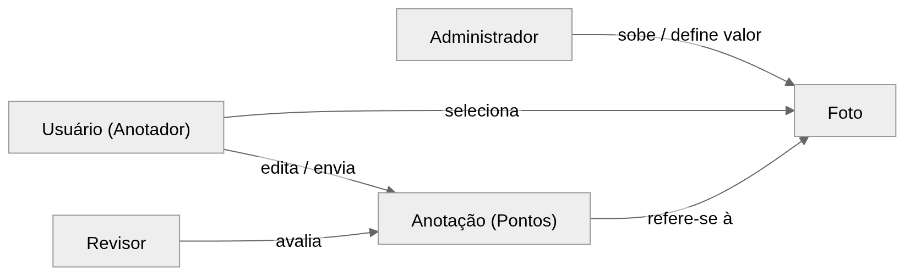
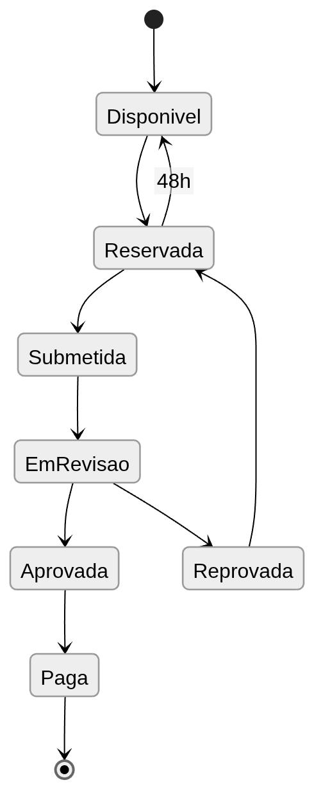

# ZenCrowd

Plataforma web para anotação manual de pessoas em imagens aéreas de multidões.  
O sistema permite marcar pontos representando indivíduos nas imagens, gerando datasets confiáveis para treinamento e avaliação de algoritmos de **crowd counting**.

## Problema

Estimativas de público em manifestações frequentemente são contestadas porque os métodos utilizados não são transparentes ou replicáveis.

Ao mesmo tempo, algoritmos modernos de visão computacional capazes de estimar multidões dependem de **datasets anotados manualmente**. A criação desses datasets exige marcar a posição de cada pessoa em imagens, normalmente com um ponto indicando a cabeça.

Esse processo é intensivo em trabalho humano e requer mecanismos de organização e controle de qualidade.

Este projeto propõe uma **plataforma web para produção organizada dessas anotações**.

## Objetivos

A plataforma tem como objetivo:

- organizar a anotação manual de imagens de multidões
- controlar a qualidade das anotações
- permitir remuneração de anotadores
- produzir datasets confiáveis para treinamento e avaliação de algoritmos de crowd counting

## Papéis na Plataforma

A plataforma possui três tipos de usuários.

### Administrador

- sobe imagens
- define o valor da tarefa
- acompanha o progresso das anotações

### Usuário (Anotador)

- seleciona imagens disponíveis
- envia anotações

### Revisor

- avalia as anotações enviadas
- aprova ou reprova resultados



## Fluxo da Tarefa

Cada imagem percorre os seguintes estados no sistema:

1. **Disponível** – imagem pronta para anotação  
2. **Reservada** – um usuário pegou a tarefa  
3. **Submetida** – anotação enviada  
4. **Em revisão** – revisão humana  
5. **Aprovada ou reprovada**  
6. **Paga** – anotação aprovada e remunerada



## Formato dos Dados

As anotações consistem em **coordenadas (x, y)** indicando a posição das cabeças na imagem.

Exemplo de arquivo CSV:

```csv
x,y
1032,845
1051,860
1104,872
```

Cada linha representa uma pessoa marcada na imagem.

## Controle de Qualidade

A qualidade das anotações é garantida por:
* revisão humana
* possibilidade de múltiplas anotações da mesma imagem
* registro de todas as ações na plataforma

## Uso dos Dados

Os dados produzidos podem ser utilizados para:
* treinamento de algoritmos de crowd counting
* avaliação comparativa de modelos
* estudos sobre participação em manifestações

## Conclusão

A plataforma organiza o trabalho humano necessário para produzir datasets de multidões de forma transparente, auditável e escalável, contribuindo para melhorar tanto a pesquisa em visão computacional quanto metodologias de estimativa de público.
